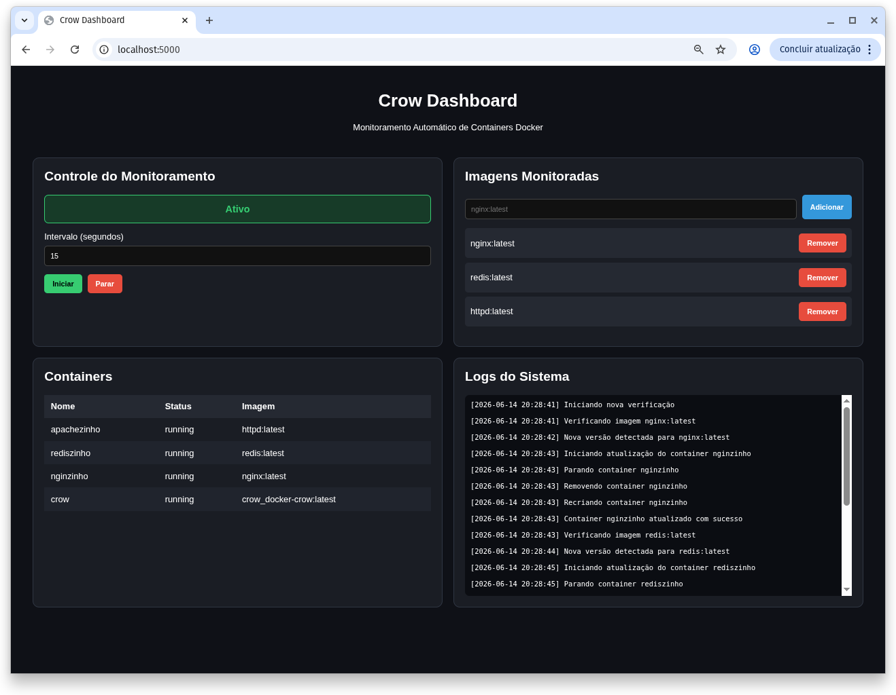
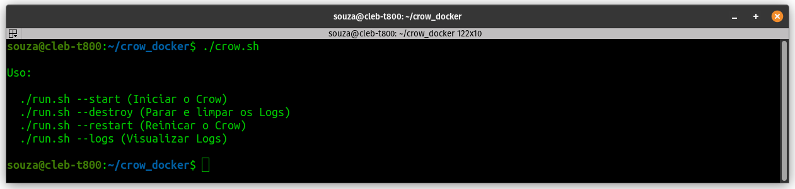
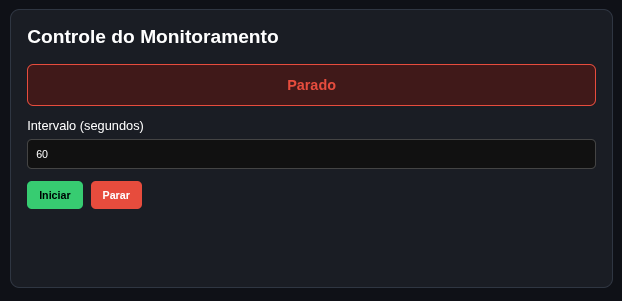

# Crow

Crow é uma ferramenta de monitoramento e atualização automática de containers Docker. Seu objetivo é identificar quando uma imagem monitorada recebe uma nova versão e recriar automaticamente os containers que utilizam essa imagem, preservando suas configurações originais.

O projeto foi desenvolvido utilizando Python, Docker SDK e Flask, fornecendo uma interface web para gerenciamento do monitoramento.

[Vídeo demo do Crow](https://drive.google.com/drive/u/1/folders/12hhqvv4hZoNcFRdkDC6o8x1eo893yCe6)
---

# Estrutura do README

Este documento está organizado nas seguintes seções:

1. **Arquitetura da Solução**
   - Visão geral dos componentes do Crow.
   - Descrição do Dashboard Web, Scheduler, Docker Manager, Image Manager e Updater.

2. **Funcionamento da Detecção**
   - Processo de monitoramento das imagens Docker.
   - Utilização do arquivo `images.json`.
   - Comparação de Image IDs para identificação de novas versões.

3. **Estratégia de Atualização**
   - Coleta das configurações do container.
   - Processo de parada, remoção e recriação.
   - Registro das operações em log.

4. **Estrutura do Projeto**
   - Organização dos diretórios e arquivos que compõem o Crow.

5. **Instruções de Execução**
   - Pré-requisitos.
   - Clonagem do repositório.
   - Inicialização da aplicação.
   - Acesso ao dashboard e configuração do monitoramento.

6. **Limitações Atuais**
   - Funcionalidades ainda não suportadas pela versão atual.

--- 

# Arquitetura da Solução

A aplicação é composta por um único container responsável por duas funções principais:

* Dashboard Web (Crow WEB)
* Scheduler de Monitoramento (Crow Monitor)

## Componentes

### Dashboard Web



Responsável pela interface de gerenciamento.

Permite:

* Visualizar containers em execução;
* Visualizar logs do sistema;
* Adicionar imagens ao monitoramento;
* Remover imagens monitoradas;
* Definir intervalo de verificação;
* Iniciar ou parar o monitoramento.

---

### Scheduler

Executa verificações periódicas das imagens configuradas.

Responsável por:

* Ler imagens monitoradas;
* Consultar atualizações disponíveis;
* Acionar o processo de atualização dos containers.

Arquivos principais:

* `scheduler.py`
* `runtime_manager.py`

---

### Docker Manager

Camada responsável pela comunicação com a API Docker.

Funções:

* Listagem de containers;
* Obtenção de configurações;
* Parada de containers;
* Remoção de containers;
* Recriação de containers.

Arquivo principal:

* `docker_manager.py`

---

### Image Manager

Responsável por verificar se uma imagem recebeu atualização.

Funções:

* Realizar pull da imagem;
* Comparar Image IDs;
* Detectar alterações.

Arquivo principal:

* `image_manager.py`

---

### Updater

Executa o processo completo de atualização.

Fluxo:

1. Detecta nova versão da imagem;
2. Localiza containers que utilizam essa imagem;
3. Salva a configuração atual;
4. Para o container;
5. Remove o container;
6. Recria o container com a nova imagem.

Arquivo principal:

* `updater.py`

---

# Funcionamento da Detecção

O Crow monitora imagens Docker definidas pelo usuário através da interface web. Sempre que uma imagem é adicionada ou removida pelo dashboard, a aplicação atualiza automaticamente o arquivo `images.json`, que funciona como fonte de configuração das imagens monitoradas. Abaixo é apresentado um exemplo da estrutura desse arquivo:

```json
{
    "imagens": [
        "nginx:latest",
        "redis:latest"
    ]
}
```

Durante cada ciclo de monitoramento:

1. O sistema identifica a imagem monitorada;
2. Obtém o Image ID local;
3. Executa um pull da imagem;
4. Obtém novamente o Image ID;
5. Compara os valores.

Exemplo:

Antes:

```text
sha256:123abc
```

Depois:

```text
sha256:789xyz
```

Se os IDs forem diferentes, uma nova versão foi detectada.

---

# Estratégia de Atualização

Quando uma atualização é identificada:

## Etapa 1 – Coleta da Configuração

O Crow captura informações essenciais do container:

* Nome;
* Variáveis de ambiente;
* Portas;
* Política de restart;
* Rede utilizada;
* Comando de execução.

---

<!-- ## Etapa 2 – Proteção de Containers Críticos

Containers internos do Crow não podem ser atualizados automaticamente. Isso é um mecanismo para que a própria ferramenta não interrompa sua execução.

Exemplo:

```python
CONTAINERS_PROTEGIDOS = [
    "crow"
]
``` -->

## Etapa 3 – Recriação

O container é:

1. Parado;
2. Removido;
3. Criado novamente utilizando a nova imagem.

A recriação preserva a configuração original.

---

## Etapa 4 – Registro em Log

Todas as ações são registradas em um arquivo log e aparece também na interface WEB

```text
logs/crow.log
```

Exemplo:

```text
[2026-06-14 20:29:31] Parando container apachezinho
[2026-06-14 20:29:33] Removendo container apachezinho
[2026-06-14 20:29:33] Recriando container apachezinho
[2026-06-14 20:29:33] Container apachezinho atualizado com sucesso
```

---

# Estrutura do Projeto

```text
crow_docker
|
├── config
│   ├── images.json
│   └── runtime.json
├── crow
│   ├── app
│   │   ├── static
│   │   │   ├── dashboard.js
│   │   │   └── style.css
│   │   ├── templates
│   │   │   └── index.html
│   │   └── views.py
│   ├── config_manager.py
│   ├── config.py
│   ├── crow.py
│   ├── Dockerfile
│   ├── docker_manager.py
│   ├── image_manager.py
│   ├── logger.py
│   ├── runtime_manager.py
│   ├── scheduler.py
│   └── updater.py
├── crow.sh
├── docker-compose.yml
├── logs
└── README.md
```

---

# Instruções de Execução

## Pré-requisitos

* Docker
* Docker Compose

Verificar instalação:

```bash
docker --version
docker compose version
```

---

## Git clone e iniciar o Crow


```
git clone https://github.com/1valcl3b/crow

```

```
cd crow
```


```bash
./crow.sh --start
```

O script recebe alguns parametros para realizar algumas ações confira na imagem abaixo:




---

## Acessar o Dashboard

Abra o navegador e acesse:

```text
http://localhost:5000
```

---

## Configurar o Monitoramento

Na interface:

1. Adicionar imagens desejadas;
2. Definir intervalo em segundos;
3. Clicar em "Iniciar".


---

Para parar o Monitoramento basta clicar no botão `Parar`, O scheduler permanecerá ativo, porém sem executar verificações.

---

## Encerrar o Crow

Volte ao terminal e execute:

```bash
./crow.sh --stop
```

O script realiza:

* Remoção dos containers;
* Remoção das imagens do projeto;
* Limpeza dos logs.

---

# Limitações Atuais

A versão atual recria containers preservando apenas configurações básicas.

Ainda não são restaurados automaticamente:

* Volumes complexos;
* Bind mounts avançados;
* Redes customizadas complexas;
* Configurações Docker Compose completas.

Essas funcionalidades podem ser incorporadas em versões futuras.

---
